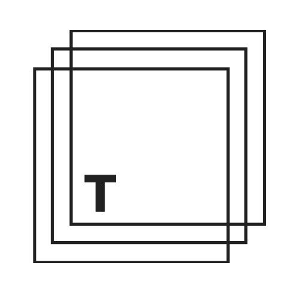
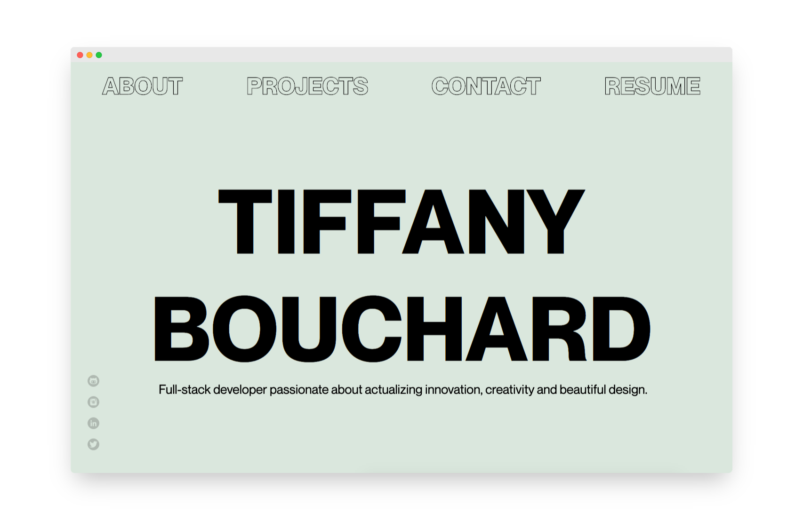

 

<h1 align="center">
  tiffbouchard.com </h1>

  

 

## Table of Contents
- [About](#about)
- [Learning Outcomes](#learning-outcomes)
- [Tech Stack](#tech-stack)
- [Design Process](#design-process)
- [Getting Started](#getting-started)
- [Next Steps](#next-steps)

## About 
My personal portfolio website built with Gatsby.js and styled-components to showcase featured projects. 

## Learning Outcomes
- Better understanding of CSS and media queries, although always room to improve
- How to use custom fonts
- How to use styled-components - benefits of CSS in JSX - however, could have been used more effectively

## Tech Stack
- Gatsby.js/React
- CSS/styled-components
- AOS 
- React Spring
- Email.js

## Design Process
- Designing and planning were done using Figma - view wireframes [here](https://www.figma.com/file/zsz5CQeViz63IhPaLdWt4l/portfolio?node-id=0%3A1)

## Getting Started 
Click [here](https://tiffbouchard.com) for live site

## Next Steps
- Make a responsive hamburger menu for better UX instead of using flex-wrap
- Better placement for socials
- Add better accessibility - especially for navigation, can only use onClick for buttons, but don't want to have focus state (figure something out or keep focus state)
- Possibly refactor styled components after doing more research/docs